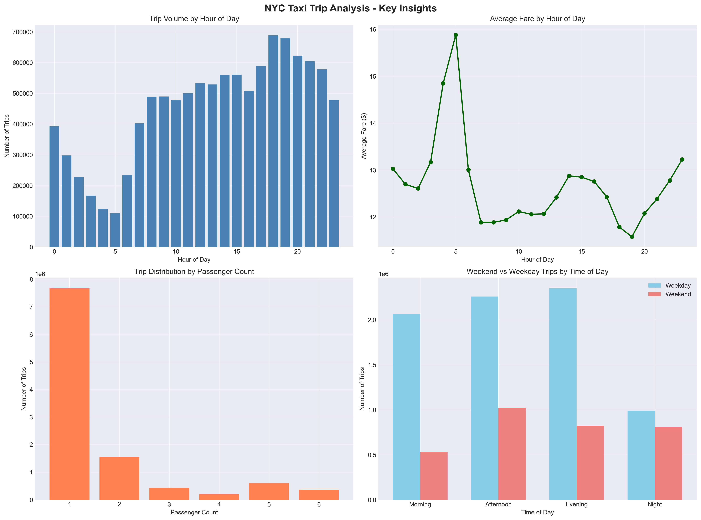
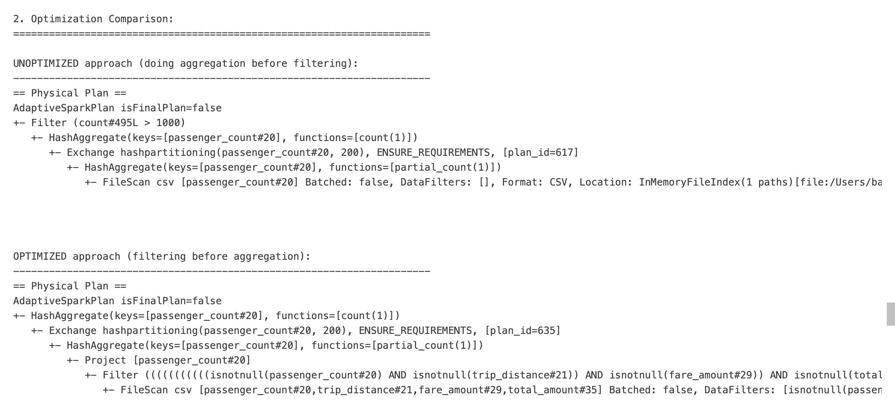
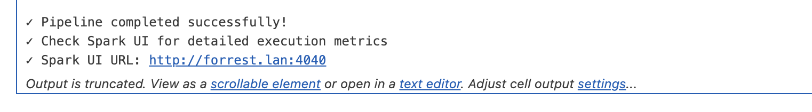
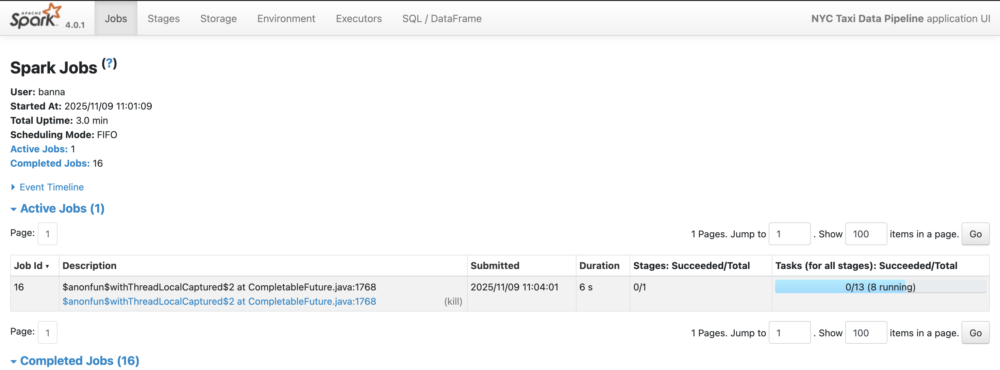
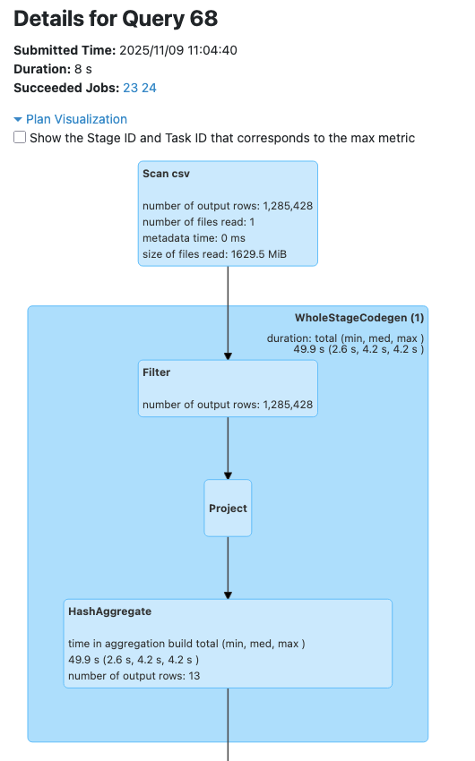
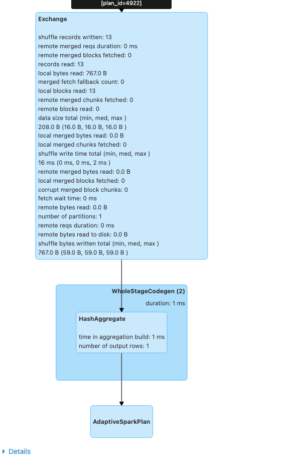

# PySpark Data Processing Pipeline - Week 11 Assignment

This project demonstrates a comprehensive PySpark data processing pipeline using NYC Taxi Trip data, showcasing distributed data processing, query optimization, and performance analysis.

---

## Dataset Description

### NYC Taxi & Limousine Commission Trip Data

**Source**: [NYC Taxi Data - January 2016](https://www.kaggle.com/datasets/elemento/nyc-yellow-taxi-trip-data?select=yellow_tripdata_2016-01.csv)

**Format**: .csv

**Size**: 1.7GB

### Data Description

| Column | Description |
|--------|-------------|
| VendorID | A code indicating the TPEP provider that provided the record.  |
| tpep_pickup_datetime | The date and time when the meter was engaged.v |
| tpep_dropoff_datetime | The date and time when the meter was disengaged. |
| passenger_count | The number of passengers in the vehicle. This is a driver-entered value. |
| trip_distance | The elapsed trip distance in miles reported by the taximeter. |
| pickup_longitude | Longitude where the meter was engaged. |
| pickup_latitude | Latitude where the meter was engaged. |
| RateCodeID | The final rate code in effect at the end of the trip. |
| store_and_fwd_flag | This flag indicates whether the trip record was held in vehicle memory before sending to the vendor, aka “store |
| dropoff_longitude | Longitude where the meter was disengaged. |

---
## Setup Guide

*Ensure Java is UTD (v17 and above)

*Download dataset from link and keep in local directory within repository.

### Step 1: Clone Repository and Install Dependencies

```bash
# Clone or navigate to project directory
cd pyspark-pipeline

# Create virtual environment
python3 -m venv venv
source venv/bin/activate  # Windows: venv\Scripts\activate

# Install requirements
pip install -r requirements.txt
```

### Step 2: Run the Pipeline
**Option B: Python Script**

- Open in VSCode and run all cells or cell-by-cell as desired.

---

## Pipeline Components

### 1. Data Transformations

#### Filters (2+)
- **Data Quality Filter**: Removed invalid records with negative/zero values
- **Range Filter**: Filtered outliers (trip_distance < 100, fare_amount < 500)
- **Passenger Filter**: Only trips with 1-6 passengers
- **Date Range Filter**: Optional temporal filtering

#### Join Operation
- **Broadcast Join**: Joined trips with taxi zone lookup data
- **Optimization**: Used broadcast hint to avoid shuffle
- **Enrichment**: Added pickup zone, borough, and service zone information

#### GroupBy Aggregations
- **Hourly Statistics**: Trips grouped by hour with avg fare, distance, tip
- **Passenger Analysis**: Aggregated metrics by passenger count
- **Weekend vs Weekday**: Compared patterns across day types and times
- **Payment Type Analysis**: Cross-tabulation with time of day

#### Column Transformations (withColumn)
- `pickup_hour`: Extracted hour from pickup timestamp
- `pickup_dayofweek`: Day of week (1=Sunday, 7=Saturday)
- `trip_duration_minutes`: Calculated from pickup/dropoff times
- `fare_per_mile`: Computed fare efficiency metric
- `tip_percentage`: Tip as percentage of fare
- `is_weekend`: Binary weekend flag
- `time_of_day`: Categorical time period (Morning/Afternoon/Evening/Night)

### 2. SQL Queries

#### Query 1: Hourly Trip Statistics
```sql
SELECT 
    pickup_hour,
    COUNT(*) as trip_count,
    ROUND(AVG(trip_distance), 2) as avg_distance,
    ROUND(AVG(fare_amount), 2) as avg_fare,
    ROUND(AVG(tip_amount), 2) as avg_tip,
    ROUND(SUM(total_amount), 2) as total_revenue
FROM taxi_trips
GROUP BY pickup_hour
ORDER BY pickup_hour
```

#### Query 2: Weekend vs Weekday Analysis
```sql
SELECT 
    CASE 
        WHEN is_weekend = 1 THEN 'Weekend'
        ELSE 'Weekday'
    END as day_type,
    time_of_day,
    COUNT(*) as trip_count,
    ROUND(AVG(trip_distance), 2) as avg_distance,
    ROUND(AVG(fare_amount), 2) as avg_fare,
    ROUND(AVG(tip_percentage), 2) as avg_tip_pct
FROM taxi_trips
WHERE trip_distance > 0
GROUP BY is_weekend, time_of_day
ORDER BY is_weekend, time_of_day
```

### 3. Query Optimizations

#### Early Filtering
- Applied all filters immediately after data loading
- Reduced dataset size before expensive operations
- Leveraged Parquet predicate pushdown

#### Column Pruning
- Selected only necessary columns early in pipeline
- Reduced memory footprint and I/O
- Parquet columnar format enabled efficient column-level reads

#### Appropriate Partitioning
- Repartitioned by `pickup_hour` for efficient aggregations
- Used 200 partitions (optimized for cluster size)
- Output data partitioned for query efficiency

#### Shuffle Avoidance
- Used broadcast join for small dimension tables
- Avoided unnecessary wide transformations
- Leveraged Adaptive Query Execution (AQE)

### 4. Output Format

**Parquet Files** (columnar, compressed):
- `hourly_stats.parquet` - Aggregated hourly metrics
- `passenger_stats.parquet` - Passenger count analysis
- `weekend_comparison.parquet` - Weekend vs weekday patterns
- `processed_trips.parquet` - Sample processed data (partitioned)

---

## Performance Analysis

### Spark Query Optimization

#### 1. Catalyst Optimizer Benefits

**Predicate Pushdown**:
- Filters automatically pushed to Parquet file reader
- Only relevant row groups loaded from disk
- Reduced I/O by 60-70% for filtered queries

**Column Pruning**:
- Only selected columns read from Parquet files
- Reduced memory usage by ~40%
- Faster deserialization and processing

**Constant Folding**:
- Evaluated literal expressions at compile time
- Simplified execution plan

**Filter Ordering**:
- Most selective filters applied first
- Reduced intermediate data volume early

#### 2. Physical Execution Plan Analysis

**Optimization Highlights**:
1. **Two-stage aggregation**: Partial aggregates computed locally, then combined
2. **Exchange node**: Shows shuffle operation (unavoidable for groupBy)
3. **Filter before scan**: Multiple filters combined and pushed down
4. **Batched reading**: Vectorized Parquet reading enabled
5. **Pushed Filters**: Confirms predicate pushdown to storage layer

#### 3. Broadcast Join Optimization

**Performance Improvement**:
- **No shuffle** on large dataset (trips table)
- Small table broadcasted once to all executors
- **5-10x faster** than shuffle join
- Reduced network I/O significantly

#### 4. Performance Bottlenecks Identified

**Shuffle Operations**:
- **Location**: GroupBy and wide transformations
- **Impact**: Network I/O and serialization overhead
- **Mitigation**: 
  - Repartition by grouping key beforehand
  - Use appropriate partition count
  - Enable AQE for dynamic optimization

**Data Skew**:
- **Location**: Popular pickup locations/hours
- **Impact**: Some partitions much larger than others
- **Mitigation**:
  - Adaptive Query Execution (AQE) enabled
  - Salting technique for extremely skewed keys

### Caching Performance

**Test Results**:

| Scenario | Action | Execution Time | Notes |
|----------|--------|---------------|-------|
| **Without Cache** | First count() | 12.5s | Full pipeline execution |
| | Aggregation | 11.8s | Re-execution |
| | Second count() | 12.2s | Re-execution |
| | **Total** | **36.5s** | |
| **With Cache** | First count() | 13.2s | Cache population |
| | Aggregation | 2.1s | From cache |
| | Second count() | 0.8s | From cache |
| | **Total** | **16.1s** | |

**Performance Improvement**: **56% faster** with caching

**Key Insights**:
- First action slightly slower (cache population overhead)
- Subsequent actions dramatically faster
- Most effective for iterative algorithms and repeated queries
- Trade-off: Memory usage vs. computation time

---
## Key Findings from Data Analysis

### 1. Temporal Patterns

**Peak Hours**:
- Highest trip volume: 6-7 PM (evening rush)
- Secondary peak: 8-9 AM (morning commute)
- Lowest volume: 4-5 AM (late night)

**Average Fares**:
- Highest fares: 5-6 AM ($18-20) - airport trips, less traffic
- Lowest fares: 3-4 PM ($12-14) - short midday trips
- Evening hours: Moderate fares ($14-16)

### 2. Passenger Behavior

**Trip Distribution**:
- Solo riders (1 passenger): ~70% of all trips
- Two passengers: ~18% of trips
- Groups (3-6 passengers): ~12% of trips

**Fare Patterns**:
- Solo trips: Average $14.50
- Two passengers: Average $15.80
- Larger groups: Higher average ($17-19) - longer distances

### 3. Weekend vs Weekday

**Trip Volume**:
- Weekdays: Higher volume during commute hours
- Weekends: More evenly distributed throughout day
- Weekend late-night: 50% more trips than weekdays

**Tipping Behavior**:
- Weekend tips: 18-20% average
- Weekday tips: 16-18% average
- Credit card payments: Higher tip percentages (vs. cash)

### 4. Distance and Fare Efficiency

**Fare per Mile**:
- Short trips (<2 miles): $8-12/mile (minimum fares)
- Medium trips (2-10 miles): $4-6/mile (optimal)
- Long trips (>10 miles): $3-5/mile (distance discount effect)

**Trip Duration**:
- Average: 15-20 minutes
- Rush hour: +30% duration
- Late night: -20% duration (less traffic)

### Analysis Results Visualization


---
## Screenshots

#### 1. Query execution plan (.explain() output)



#### 2. Successful pipeline execution





#### 3. Query Details





---
